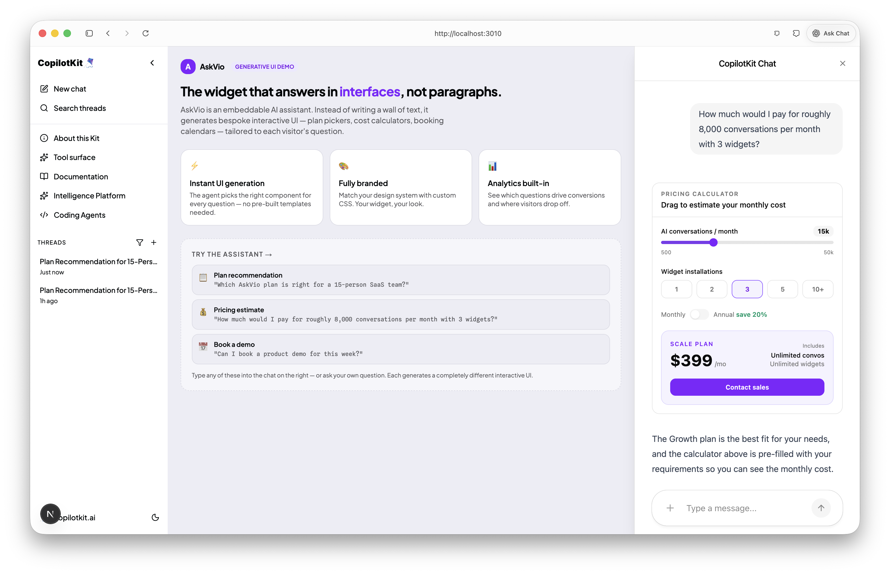
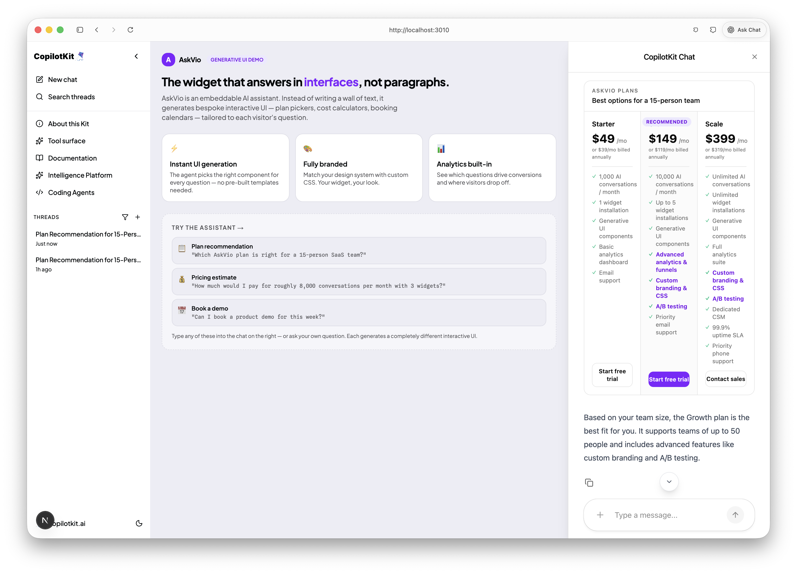
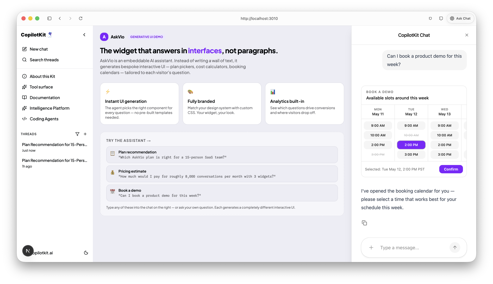
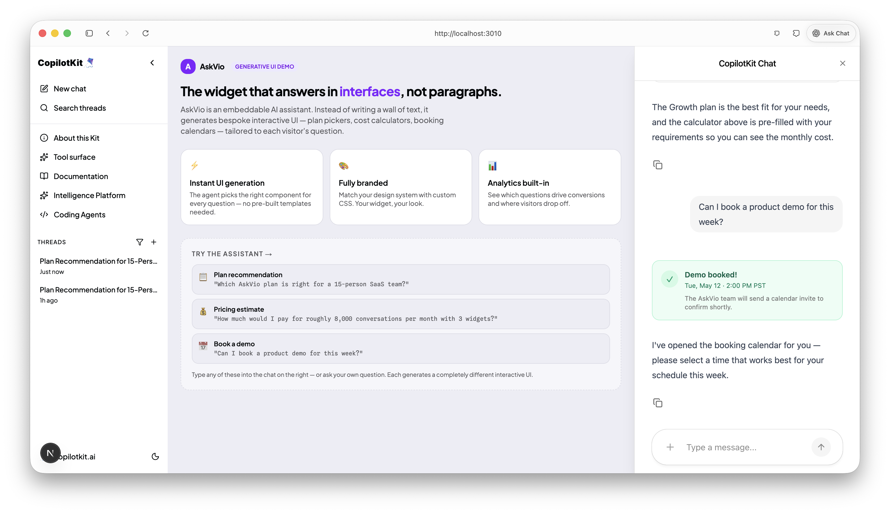

# AskVio - Generative UI Prototype

[**AskVio**](https://askvio.app?utm_source=ai-tinkers-hackaton) is an embeddable AI assistant that answers visitor questions. In the production version, it produces only textual output (and some simple product cards and links).
In the context of the AI Tinkers Generative UI Hackaton we want to improve AskVio to render interactive UI. When someone on your site asks "which plan fits me?", AskVio shouldn't write a bullet list. It should render a plan-picker. When they ask "how much for my team?", it will renders a live pricing calculator. When they want a demo, it will render a booking calendar.

This repo is the reference implementation built for the [AI Tinkerers Generative UI Hackathon](https://sf.aitinkerers.org/p/generative-ui-global-hackathon-agentic-interfaces-sf). It demonstrates the pattern: one embeddable widget, unlimited specialized interfaces.

---

## Live demo

Three questions, three completely different generated UIs all inside the same widget.
These questions have been thought as they are the one that are most commonly asked by people using the widget on website of different industries. 

| Question | Generated UI |
|---|---|
| "Which (AskVio) plan is right for a 15-person SaaS team?" | Interactive plan-comparison cards with the recommended plan highlighted |
| "How much for ~8,000 conversations/month with 3 widgets?" | Live pricing calculator, pre-filled and interactive |
| "Can I book a product demo this week?" | 5-day booking calendar, pick a slot and confirm |

##### Outcome





---

## Architecture

```
┌─────────────────────────────────────────────────────────────┐
│  Next.js frontend (port 3000)                               │
│  ┌──────────────────────┐  ┌──────────────────────────────┐ │
│  │  Product page (left) │  │  CopilotKit chat (right)     │ │
│  │  Static AskVio info  │  │  Renders UI components inline│ │
│  └──────────────────────┘  └──────────────────────────────┘ │
└──────────────────────┬──────────────────────────────────────┘
                       │ AG-UI / WebSocket
┌──────────────────────▼──────────────────────────────────────┐
│  BFF — Hono server (port 4000)                              │
│  CopilotKit Runtime → LangGraph agent bridge                │
└──────────────────────┬──────────────────────────────────────┘
                       │ LangGraph API
┌──────────────────────▼──────────────────────────────────────┐
│  Python agent — LangGraph + Gemini (port 8133)              │
│  Calls frontend tools: renderPlanPicker,                    │
│  renderPricingCalculator, renderBookingSlots                │
└─────────────────────────────────────────────────────────────┘
                       │
┌──────────────────────▼──────────────────────────────────────┐
│  CopilotKit Intelligence — Docker (Postgres + Redis)        │
│  Durable conversation threads across sessions               │
└─────────────────────────────────────────────────────────────┘
```

**Stack:** Next.js · CopilotKit v2 · AG-UI · LangGraph · Gemini Flash-Lite · Hono · Docker

The three generative UI components (`PlanPicker`, `PricingCalculator`, `BookingSlots`) are registered as frontend tools via `useFrontendTool({ render })`. The Python agent calls them by name; CopilotKit streams the component into the chat bubble in real time.

---

## How to run it locally

### Prerequisites

- **Node.js** ≥ 18 and **npm** ≥ 9
- **Python** ≥ 3.11 with **[uv](https://docs.astral.sh/uv/)** — the project uses `uv` as the Python package manager
- **Docker Desktop** (for Postgres + Redis via CopilotKit Intelligence)
- A **Gemini API key** (free tier works) — get one at [aistudio.google.com](https://aistudio.google.com)
- A **CopilotKit license token** — run `npm run license` after cloning (free for development)

---

### Step 1 — Clone and install dependencies

```bash
git clone https://github.com/your-org/askvio-genui-1.git
cd askvio-genui-1
npm install          # installs Node deps + runs `uv sync` for the Python agent
```

`npm install` also runs `uv sync` automatically (via `postinstall`). If it fails, run it manually:

```bash
cd apps/agent && uv sync && cd ../..
```

---

### Step 2 — Set environment variables

Copy the root example and the agent example:

```bash
cp .env.example .env
cp apps/agent/.env.example apps/agent/.env
```

Then open **both** files and fill in these keys:

#### `.env` (root — read by Next.js and BFF)

| Variable | What to put | Where to get it |
|---|---|---|
| `GEMINI_API_KEY` | Your Gemini API key (starts with `AIza`) | [aistudio.google.com](https://aistudio.google.com) → **Get API key** |
| `COPILOTKIT_LICENSE_TOKEN` | Your CopilotKit license token | Run `npm run license` in this repo |

Leave all other variables at their defaults — the Docker ports, LangGraph URL, and BFF URL are pre-wired for local development.

#### `apps/agent/.env` (read by LangGraph from the agent directory)

Copy the same two keys:

```bash
GEMINI_API_KEY=AIza...          # same key as root .env
COPILOTKIT_LICENSE_TOKEN=...    # same token as root .env
```

> **Shortcut:** after editing root `.env`, run `cp .env apps/agent/.env` to sync both files. Then remove the lines that aren't needed in the agent env (anything not in the agent's `.env.example`).

#### Optional: use Claude Sonnet instead of Gemini

If you have an Anthropic API key and want to run Claude Sonnet 4.6 as the agent model, set:

```bash
# In both .env and apps/agent/.env:
AGENT_RUNTIME=claude-sonnet-4-6-react
ANTHROPIC_API_KEY=sk-ant-...
```

---

### Step 3 — Start Docker (CopilotKit Intelligence)

Make sure Docker Desktop is running, then:

```bash
npm run dev:infra
```

This starts Postgres + Redis in Docker and seeds the default user. You'll see:

```
✔ Container intelligence-postgres  Started
✔ Container intelligence-redis     Started
Seeding default user... done.
```

> **Trouble?** If Docker isn't running you'll see `Cannot connect to Docker`. Start Docker Desktop and retry.

---

### Step 4 — Run the full dev stack

```bash
npm run dev
```

This concurrently starts three processes:

| Process | Port | What it does |
|---|---|---|
| Next.js frontend (`ui`) | 3000 | The AskVio demo page |
| BFF / CopilotKit Runtime (`bff`) | 4000 | Bridges frontend ↔ agent |
| LangGraph agent (`agent`) | 8133 | Python agent with Gemini |

Wait until all three show a "ready" message (usually ~15 seconds). You'll see:

```
[ui]    ✓  Ready in Xs — http://localhost:3000
[bff]   BFF ready at http://localhost:4000
[agent] INFO:     Application startup complete.
```

---

### Step 5 — Open the demo

Navigate to **[http://localhost:3000](http://localhost:3000)** — it redirects to `/demo`.

You'll see the AskVio product page on the left and the chat assistant on the right. Three starter suggestions appear in the chat — click one or type your own question.

**Try these to see each generative UI component:**

```
"Which AskVio plan is right for a 15-person SaaS team?"
```
→ Renders `PlanPicker` — three plan cards with the recommended one highlighted.

```
"How much would I pay for 8,000 conversations per month with 3 widgets?"
```
→ Renders `PricingCalculator` — pre-filled with your numbers, live-updating as you drag.

```
"Can I book a product demo for this week?"
```
→ Renders `BookingSlots` — a 5-day calendar grid, pick a slot and confirm.

---

## Generative UI — how it works

The three components are registered as **frontend tools** in [`apps/frontend/src/app/demo/page.tsx`](apps/frontend/src/app/demo/page.tsx):

```tsx
useFrontendTool({
  name: "renderPlanPicker",
  parameters: z.object({ recommended: ..., teamSize: ..., highlightFeatures: ... }),
  render: ({ args }) => <PlanPicker {...args} />,
});
```

The Python agent ([`apps/agent/src/prompts.py`](apps/agent/src/prompts.py)) knows these tools exist and is instructed to call them instead of writing text answers. CopilotKit's AG-UI protocol streams the tool call from the agent to the frontend, where the `render` function mounts the component inline in the chat.

The result: same widget URL, completely different UI per question. No pre-built templates — the agent decides which component to render and how to populate its props.

---

## Project structure

```
apps/
├── frontend/                   Next.js app
│   └── src/
│       ├── app/demo/page.tsx   Main demo page — tool registrations
│       ├── components/demo/    Generative UI components
│       │   ├── PlanPicker.tsx
│       │   ├── PricingCalculator.tsx
│       │   └── BookingSlots.tsx
│       └── lib/demo/data.ts    Synthetic AskVio plan + slot data
├── agent/                      Python LangGraph agent
│   ├── main.py                 Entry point
│   └── src/
│       ├── prompts.py          AskVio system prompt + tool instructions
│       └── runtime.py          Switchable model runtime
├── bff/                        Hono BFF (CopilotKit Runtime)
└── mcp/                        Deployable MCP server (Manufact/mcp-use)
```

---

## Switching the AI model

Edit `AGENT_RUNTIME` in `.env` and `apps/agent/.env`:

| Value | Model | Notes |
|---|---|---|
| `gemini-flash-deep` | Gemini Flash-Lite + deepagents | Default; fast, free tier available |
| `gemini-flash-react` | Gemini Flash-Lite + react agent | Simpler planner, lower latency |
| `claude-sonnet-4-6-react` | Claude Sonnet 4.6 + react agent | Requires `ANTHROPIC_API_KEY` |

---

## Troubleshooting

**`npm run dev` fails with "missing env vars"**
Run `npm run check-env` to see which keys are missing and what to do about each one.

**Chat says "Set `GEMINI_API_KEY`..."**
The agent booted in noop mode because the key is missing or still set to the `stub-...` placeholder. Add your real key to both `.env` and `apps/agent/.env`, then restart.

**Thread locked / "AgentThreadLockedError"**
A previous turn errored mid-stream. Click **+** in the threads sidebar to start a fresh conversation.

**Docker ports already in use**
The `.env` defaults use non-standard ports (5433, 6381, 4203, 4403) to avoid collisions with other local stacks. If those are also in use, change the `*_HOST_PORT` vars in `.env`.

**`uv sync` fails on Python deps**
Make sure you have Python ≥ 3.11: `python3 --version`. If `uv` isn't installed: `pip install uv` or `brew install uv`.

---

## License

MIT — built at the [AI Tinkerers Generative UI Global Hackathon](https://sf.aitinkerers.org/p/generative-ui-global-hackathon-agentic-interfaces-sf).

---

> **AskVio** — [askvio.app](https://askvio.app?utm_source=ai-tinkers-hackaton)
